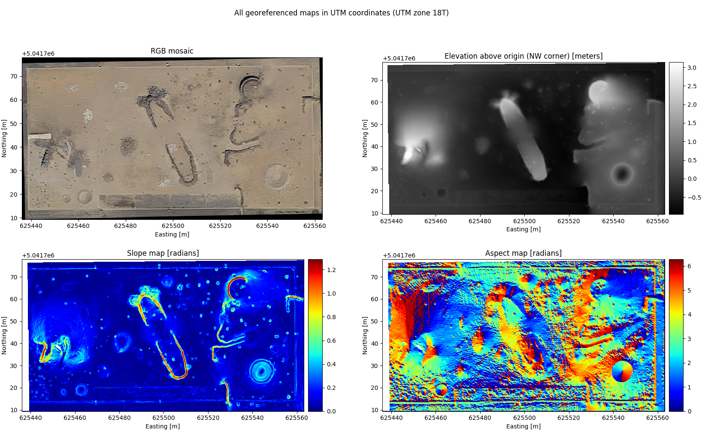
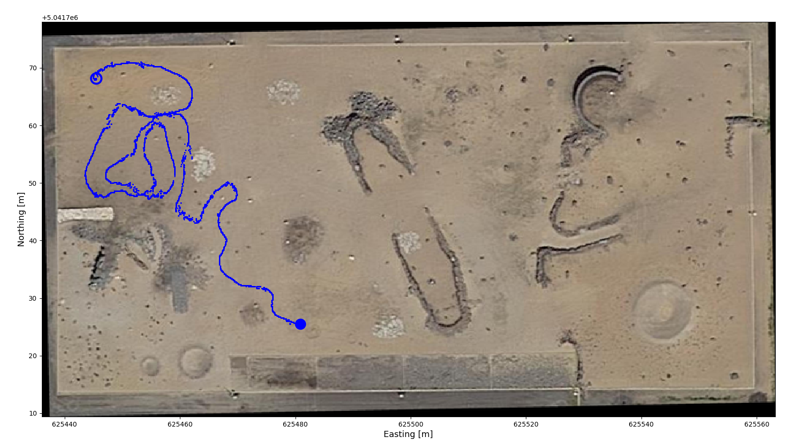
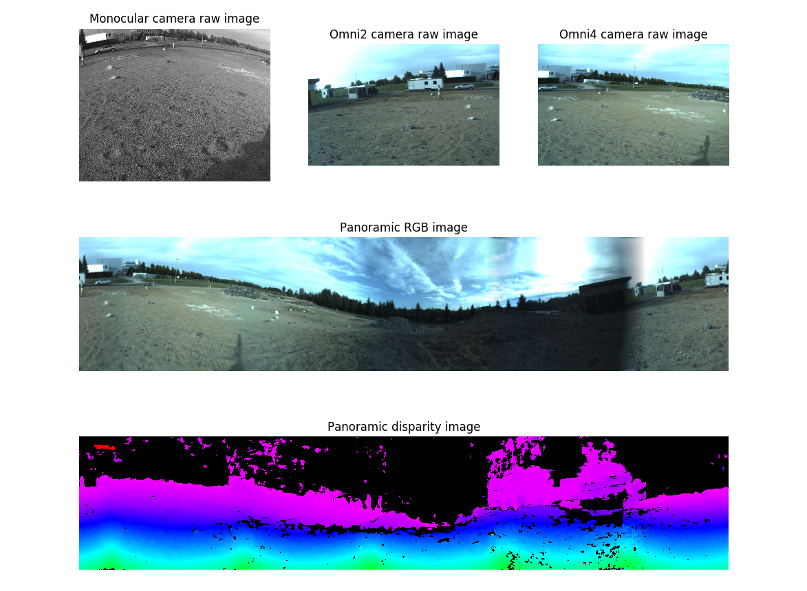
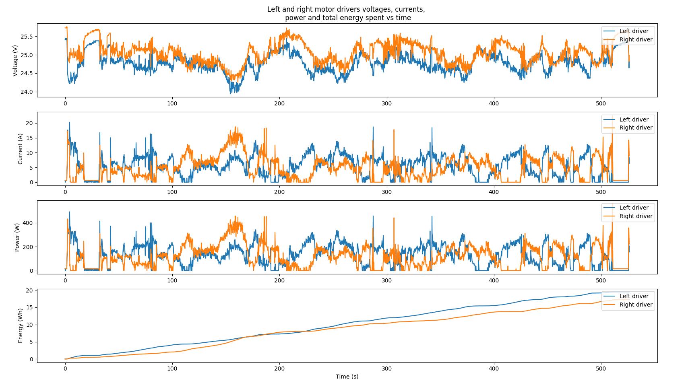
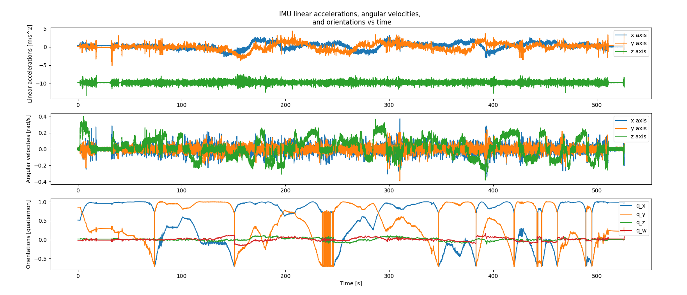
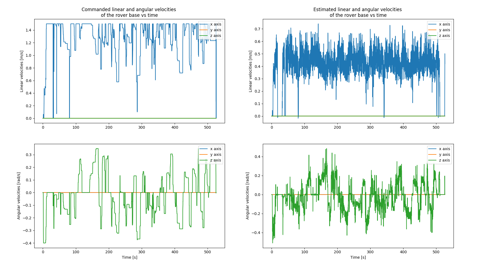

# enav_utilities <!-- omit in toc -->

Two main Python fetching classes were created to convert rosbag & aerial map data to generic formats for visualization and/or further processing.

## Table of contents <!-- omit in toc -->
- [Aerial maps visualization](#aerial-maps-visualization)
- [Rosbag data fetching](#rosbag-data-fetching)
  - [GPS data (& spatial plotting)](#gps-data--spatial-plotting)
  - [Images](#images)
  - [Point clouds](#point-clouds)
  - [Energy consumption](#energy-consumption)
  - [Solar irradiance](#solar-irradiance)
  - [IMU data](#imu-data)
  - [Encoder data](#encoder-data)
  - [Commanded and estimated velocities](#commanded-and-estimated-velocities)

## Aerial maps visualization

To load any aerial map, a CSASite instance from [csa_raster_load.py](csa_raster_load.py) needs to be initialized using the path to the directory containing the mapping data. An example showing how to properly use this Python class is shown in the [show_raster.py](sample_scripts/show_raster.py) example:

```sh
python show_raster.py -d /path/to/raster/directory
```



---

## Rosbag data fetching

To load data from a rosbag, a FetchEnergyDataset instance from [rosbag_data_load.py](rosbag_data_load.py) needs to be initialized using the path to the said rosbag. Several methods within this class are available to fetch specific data streams.

### GPS data (& spatial plotting)

The complete GPS history is accessed through the `load_gps_data` method documented [here](rosbag_data_load.py#L605). The following sample spatial plot was generated using the [plot_gps_data.py](sample_scripts/plot_gps_data.py) sample script:

```sh
python plot_gps_data.py -b /path/to/file.bag -d /path/to/raster/directory
```



### Images

Images are accessed through the `load_image_data` method documented [here](rosbag_data_load.py#L486). The following sample plot was generated using the [plot_images.py](sample_scripts/plot_images.py) sample script:

```sh
python plot_images.py -b /path/to/file.bag
```



### Point clouds

Similar to images, point clouds can be fetched as numpy arrays by using the `load_pointcloud_data` method documented [here](rosbag_data_load.py#L413). Note that point clouds are saved in a separate rosbag for each run, so a rosbag different from the one needed for all other data types needs to be loaded.

### Energy consumption

The complete power and energy consumption history of the left and right motor drivers onboard the Husky rover base is accessed through the `load_energy_data` method documented [here](rosbag_data_load.py#L270). The following sample plot was generated using the [plot_energy.py](sample_scripts/plot_energy.py) sample script:

```sh
python plot_energy.py -b /path/to/file.bag
```



### Solar irradiance

The complete solar irradiance history on top of the rover's top plane is accessed through the `load_irradiance_data` method documented [here](rosbag_data_load.py#L222). The following sample plot was generated using the [plot_irradiance.py](sample_scripts/plot_irradiance.py) sample script:

```sh
python plot_irradiance.py -b /path/to/file.bag
```


### IMU data

The complete IMU history is accessed through the `load_imu_data` method documented [here](rosbag_data_load.py#L347). The following sample plot was generated using the [plot_imu_data.py](sample_scripts/plot_imu_data.py) sample script:

```sh
python plot_imu_data.py -b /path/to/file.bag
```



### Encoder data

The complete encoder history (angular positions and velocities) is accessed through the `load_encoder_data` method documented [here](rosbag_data_load.py#L167).

### Commanded and estimated velocities

Target/commanded velocities were recorded and can be accessed via the `load_cmd_vel_data` method documented [here](rosbag_data_load.py#L53). Planar velocity estimates of the mobile base were computed from encoder velocities. Those can be accessed through the `load_est_vel_data` method documented [here](rosbag_data_load.py#L110). The following sample plot was generated using the [plot_cmd_est_velocity_data.py](sample_scripts/plot_cmd_est_velocity_data.py) sample script:

```sh
python plot_cmd_est_velocity_data.py -b /path/to/file.bag
```


