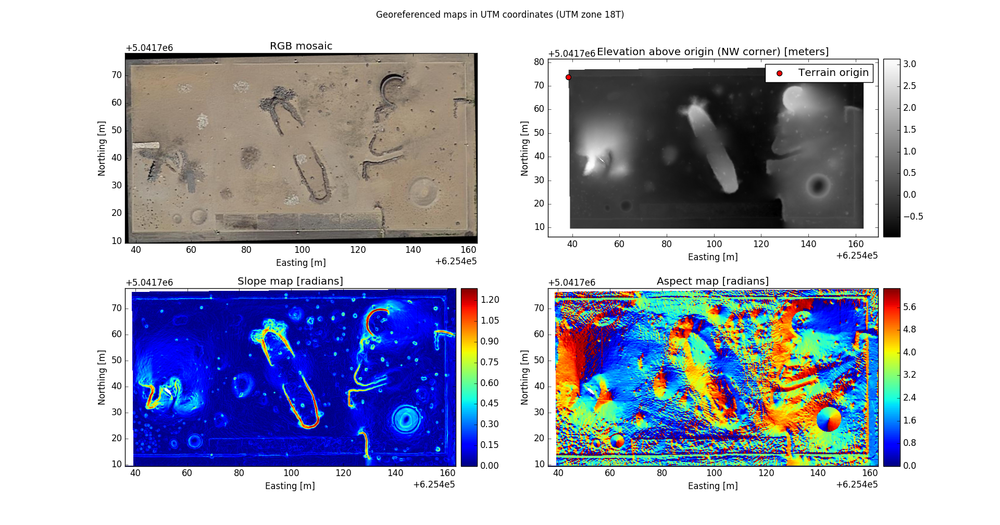
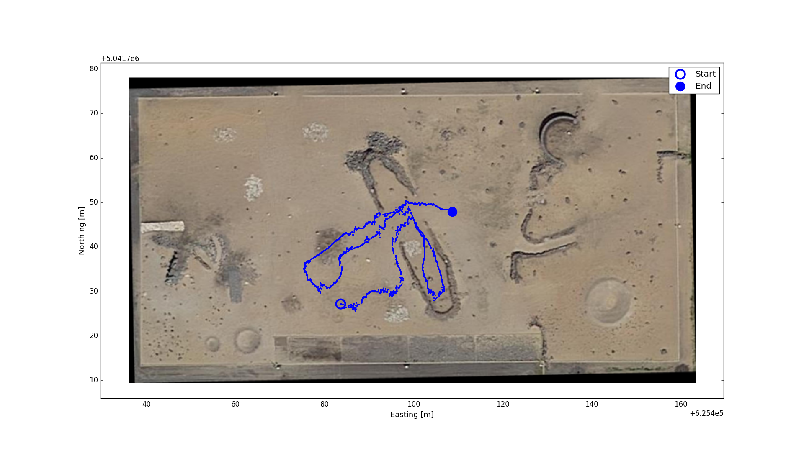
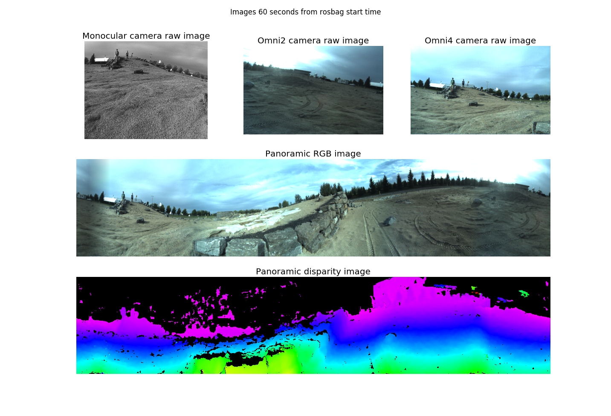
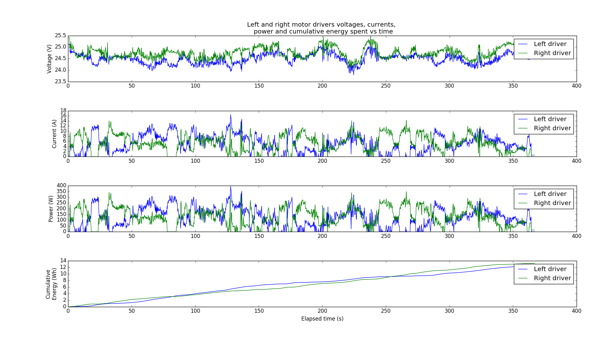
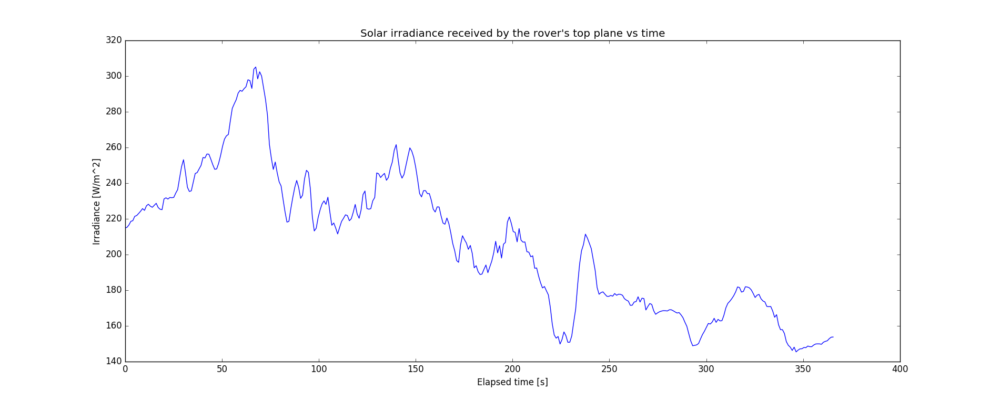
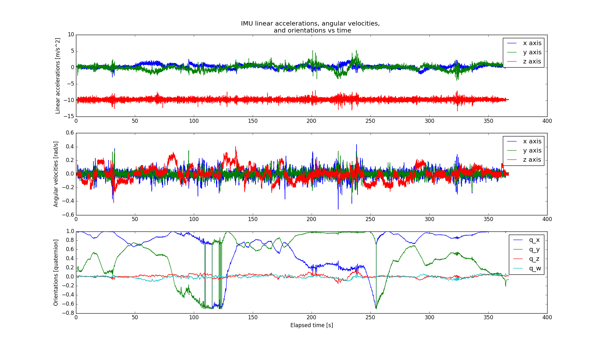
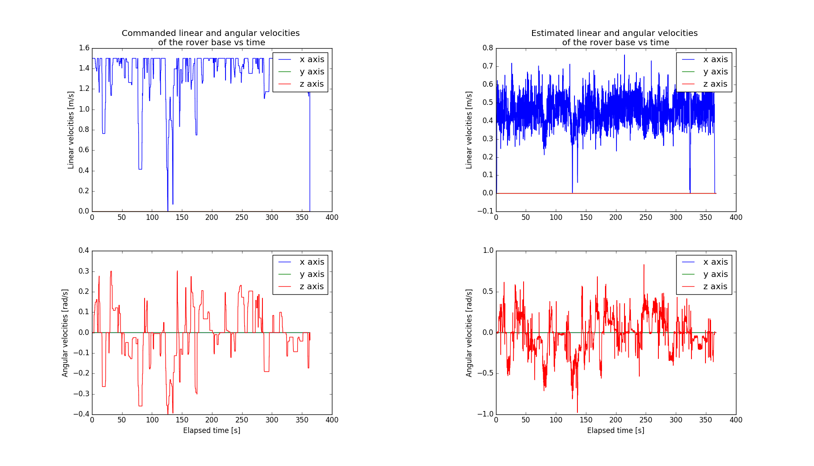

# enav_utilities <!-- omit in toc -->

A lightweight python package for rosbag data extraction. Sample plotting scripts are included.

First, read the project's main [README.md](https://github.com/utiasSTARS/enav-planetary-dataset/blob/master/README.md) and set up / run a Docker container of the ENAV image. The data loading instances are globally importable; scripts mentioned below show usage examples and are located in the container at `/root/enav_utilities/scripts`.

## Table of contents <!-- omit in toc -->

- [Package setup](#package-setup)
- [Aerial maps visualization](#aerial-maps-visualization)
- [Rosbag data fetching](#rosbag-data-fetching)
  - [GPS data (& spatial plotting)](#gps-data--spatial-plotting)
  - [Images](#images)
  - [Point clouds](#point-clouds)
  - [Energy consumption](#energy-consumption)
  - [Solar irradiance](#solar-irradiance)
  - [IMU data](#imu-data)
  - [Encoder data](#encoder-data)
  - [Commanded and estimated velocities](#commanded-and-estimated-velocities)

## Aerial maps visualization

A [ENAVMapsLoader](src/enav_utilities/maps_loader.py) instance handles georeferenced maps loading & related metadata. Plotting example script:

```sh
python plot_rasters.py -d /enav_dataset/maps
```



## Rosbag data fetching

A [ENAVRosbagLoader](src/enav_utilities/rosbag_loader.py) instance is initialized with a specific rosbag path and provides methods to access every data stream. Some usage examples are provided below.

### GPS data (& spatial plotting)

```sh
python plot_gps_data.py -b /path/to/file.bag -d /path/to/maps
```



### Images

```sh
python plot_images.py -b /path/to/file.bag
```



### Point clouds

Refer to the `load_pointcloud_data` method. Note that point clouds are saved in a separate rosbag for each run, so a rosbag different from the one needed for all other data types needs to be loaded.

### Energy consumption

```sh
python plot_energy.py -b /path/to/file.bag
```



### Solar irradiance

```sh
python plot_irradiance.py -b /path/to/file.bag
```



### IMU data

```sh
python plot_imu_data.py -b /path/to/file.bag
```



### Encoder data

Refer to the `load_encoder_data` method.

### Commanded and estimated velocities

```sh
python plot_cmd_est_velocity_data.py -b /path/to/file.bag
```


